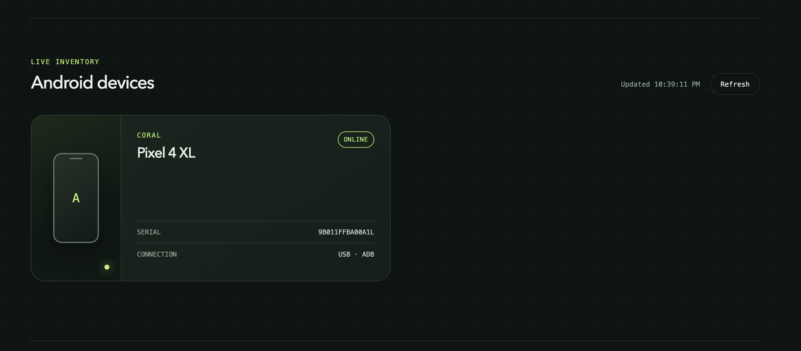

Physical device lab

# Your devices, within reach.

PocketPortal is a self-hosted control plane that makes real Android hardware available for secure remote access, application installation, and approved automated testing.

[Get started](getting-started/index.md){ .md-button .md-button--primary }
[View the API](api.md){ .md-button }

<figure class="pp-product-shot">
  
  <figcaption>Live inventory from the first Android device connected to PocketPortal.</figcaption>
</figure>

## Current capabilities

  

    <h3>One cohesive service</h3>
    
A clean-architecture Kotlin/Ktor backend serves the responsive React dashboard as a single deployable application.

  

  

    <h3>Live Android inventory</h3>
    
Typed ADB discovery reports online, offline, unauthorized, and other device states with automatic refresh.

  

  

    <h3>Operationally safe</h3>
    
Validated configuration, bounded processes, explicit recovery states, versioned installation, diagnostics, and rollback.

  

  

    <h3>Tested at every boundary</h3>
    
Unit, component, adapter, API, clean-room, and real Ubuntu host verification keep changes dependable.

  

## Built for the lab you actually have

PocketPortal will remain application-project agnostic. It manages devices, users, artifacts, approved test suites, leases, runs, and audit events without requiring source-code projects or workspaces.

The initial deployment target is an Ubuntu home server with physical Android devices connected through a powered USB hub. The hardware-facing service runs directly on the host so USB, ADB, and scrcpy remain straightforward to operate.

!!! note
    PocketPortal is under active development and is not ready for unattended production use.
